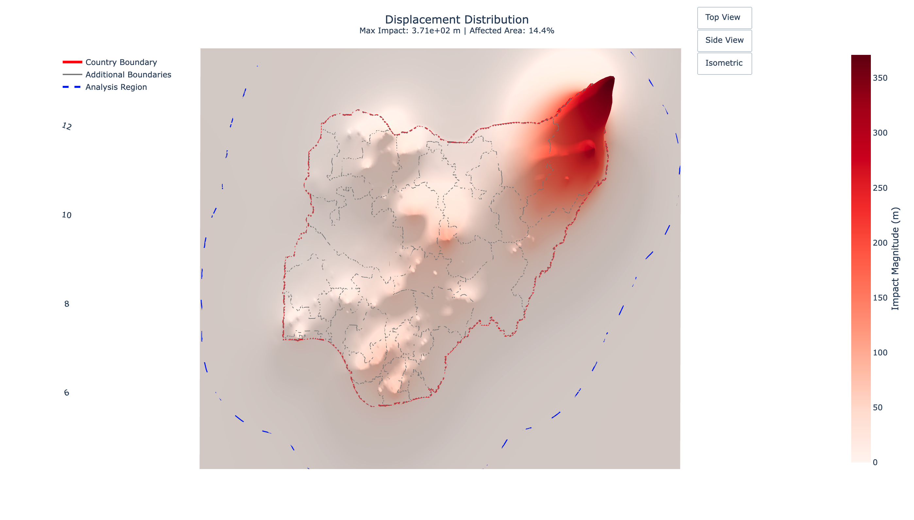

# Social Fabric Analysis Framework

[](https://doi.org/10.5281/zenodo.16509938)

A computational framework for simulating societal impacts of conflict through finite element analysis (FEA), treating communities as deformable plates with properties like resilience and vulnerability.




## Project Overview

The Social Fabric Analysis Framework is an innovative open-source Python toolkit that applies **finite element analysis** to model how violence and conflict propagate through social systems. By treating communities as deformable plates with material properties representing social characteristics (resilience, vulnerability, etc.), the framework can simulate the spatial and temporal dynamics of conflict impacts.

### Theoretical Foundation

This framework is based on the concept of **"social fabric"** - treating communities as elastic plates where:
- **Thickness (h)** represents absorptive capacity
- **Young's Modulus (E)** represents resistance to deformation
- **Poisson's Ratio (ν)** represents inter-regional connectedness and lateral coupling
- **Displacement** serves as a proxy for cumulative conflict impact intensity

The mathematical foundation uses **Kirchhoff-Love plate theory** with bending stiffness:
```
D = (E × h³) / (12 × (1 - ν²))
```

For detailed theoretical background and methodology, see the associated research paper:
**"Applying Computational Engineering Modelling to Analyse the Social Impact of Conflict and Violent Events"** - [arXiv:2503.02771](https://arxiv.org/abs/2503.02771)

### Key Features

- **Finite Element Analysis**: 2D plate bending analysis for modeling social deformation
- **Conflict Event Translation**: Converts conflict events into mechanical forces with configurable parameters
- **Social Characteristics Integration**: Maps socioeconomic indicators to material properties
- **Geospatial Support**: Handles real-world geographic data and coordinate systems
- **Interactive Visualization**: 3D plotting and interactive result exploration
- **Modular Design**: Separate modules for mesh generation, conflict translation, and social characteristics


## Quick Installation

```bash
# Clone the repository
git clone https://github.com/felixschwebel/Social-Fabric-Analysis-Framework.git
cd Social-Fabric-Analysis-Framework

# Install Python dependencies
pip install -r requirements.txt

# For development and testing (optional)
pip install jupyter ipywidgets plotly contextily
```

## Quick Start

### Basic Usage

```python
from fea_mesh_2d import FEAMesh2D
from conflict_translation import EventTranslator, apply_multiple_forces
from social_characteristics_translation import IndicatorManager

# Create a 2D mesh
mesh = FEAMesh2D(width=100000, height=100000, nx=50, ny=50)

# Set up conflict event translator
translator = EventTranslator(democracy_index=0.5, event_type_config={...})

# Apply social characteristics
indicator_manager = IndicatorManager(mesh, base_thickness=2000.0, base_youngs_modulus=1e9)
# Add indicators and compute material properties...

# Solve for conflict impacts
force_configs = translator.translate_events(events_df, current_date)
u = apply_multiple_forces(mesh, force_configs, fixed_nodes)

# Visualize results
mesh.plot_interactive(u, scale=1.0)
```

### Example: Nigeria Conflict Analysis

The framework includes a proof-of-concept demonstration analyzing conflict events in Nigeria (2018):

```python
# Load the demonstration notebook
jupyter notebook proof_of_concept_demonstration.ipynb
```

## Project Structure

```
Social-Fabric-Analysis-Framework/
├── fea_mesh_2d.py                    # Core FEA mesh and solver
├── conflict_translation.py            # Conflict event to force translation
├── social_characteristics_translation.py  # Social indicators to material properties
├── requirements.txt                   # Python dependencies
├── data/                             # Datasets (not provided in this repo)
│   └── ...
├── testing/                          # Validation and testing scripts
│   ├── technical_validation.ipynb
│   ├── testing_scenarios.ipynb
│   └── testing.py
├── output/                           # Generated results
└── proof_of_concept_demonstration.ipynb  # Main demonstration
```

## Core Components

### 1. FEA Mesh (`fea_mesh_2d.py`)

The `FEAMesh2D` class provides:
- 2D quadrilateral mesh generation
- Plate bending finite element analysis
- Material property management (Young's modulus, Poisson's ratio, thickness)
- Boundary condition handling
- Result visualization and plotting

### 2. Conflict Translation (`conflict_translation.py`)

The `EventTranslator` class converts conflict events into mechanical forces:
- Configurable force magnitude calculation
- Spatial distribution (point, Gaussian, linear, constant)
- Temporal decay modeling
- Democracy index adjustments
- Civilian targeting factors

### 3. Social Characteristics (`social_characteristics_translation.py`)

The `IndicatorManager` class maps social indicators to material properties:
- TIFF data import and normalization
- Multiple response functions (linear, logarithmic, exponential, etc.)
- Dependency relationships between indicators
- Material property computation and validation

## Configuration

### Force Configuration

```python
from conflict_translation import ForceConfig, Distribution

config = ForceConfig(
    base_magnitude=1e6,
    fatality_weight=0.5,
    civilian_factor=1.5,
    decay_rate=0.1,
    distribution=Distribution.GAUSSIAN,
    base_radius=5000,
    expansion_rate=0.2,
    max_expansion=2.0
)
```

### Indicator Configuration

```python
from social_characteristics_translation import ResponseConfig, ResponseType, RangeType

response_config = ResponseConfig(
    function_type=ResponseType.LOGARITHMIC,
    parameters={'alpha': 1.0},
    range_type=RangeType.RESILIENCE
)
```

## Testing and Validation

The framework includes comprehensive testing:

- **Technical Validation**: Mathematical correctness and convergence tests
- **Testing Scenarios**: Various conflict and social characteristic configurations
- **Unit Tests**: Individual component functionality verification

Run tests:
```bash
cd testing
python testing.py
```

## Data Requirements

The framework automatically handles data normalization and processing. Users need to provide raw data in the following formats:

### Conflict Events Data
- **Format**: CSV with ACLED-compatible structure
- **Required fields**: 
  - `latitude`, `longitude` (coordinates in decimal degrees)
  - `event_date` (datetime format)
  - `event_type` (e.g., "Battles", "Explosions/Remote violence", "Protests")
  - `sub_event_type` (e.g., "Armed clash", "Shelling/artillery/missile", "Protest")
  - `fatalities` (number of casualties)
  - `civilian_targeting` (boolean)
- **Source**: [Armed Conflict Location & Event Data Project (ACLED)](https://acleddata.com/)

### Social Indicators Data
- **Format**: GeoTIFF files with geographic coordinate system

### Geographic Boundaries
- **Format**: Shapefile (.shp) with associated files
- **Required**: Administrative boundaries for study region
- **Example**: `nigeria_adm0/nigeria.shp` (country level), `nigeria_adm1/` (state level)

### Democracy Index
- **Source**: [V-Dem Liberal Democracy Index](https://www.v-dem.net/)
- **Format**: Single value (0-1 scale) for the study region and time period
- **Usage**: Adjusts protest force magnitudes based on democratic context

### Data Processing
The framework automatically:
- Resamples GeoTIFF data to mesh resolution
- Normalizes social indicators to appropriate ranges (resilience: 0-1, vulnerability: -1 to 0)
- Handles missing data and coordinate system transformations
- Applies response functions and dependency relationships between indicators

## Output and Visualization

The framework provides multiple visualization options:

- **2D Contour Plots**: Displacement magnitude and direction
- **3D Surface Plots**: Interactive 3D deformation visualization
- **Material Property Maps**: Social characteristic distributions
- **Force Application Preview**: Conflict event spatial distribution

## Contributing

1. Fork the repository
2. Create a feature branch
3. Add tests for new functionality
4. Ensure all tests pass
5. Submit a pull request

## Citation

If you use this software in your research, please cite:

```bibtex
@software{schwebel2024social,
  title={Social-Fabric-Analysis-Framework},
  author={Schwebel, Felix and Meynen, Sebastian and García-Herranz, Manuel},
  year={2024},
  doi={10.5281/zenodo.16509938},
  url={https://github.com/felixschwebel/Social-Fabric-Analysis-Framework}
}
```

For the associated research paper:
```bibtex
@article{schwebel2025computational,
  title={Applying Computational Engineering Modelling to Analyse the Social Impact of Conflict and Violent Events},
  author={Schwebel, Felix and Meynen, Sebastian and García-Herranz, Manuel},
  journal={arXiv preprint arXiv:2503.02771},
  year={2025}
}
```

## License

This project is licensed under the MIT License - see the [LICENSE](LICENSE) file for details.

## Acknowledgments

- ACLED for conflict event data
- GDAL/Geopandas for geospatial data handling
- SciPy for finite element computations
- Plotly for interactive visualizations